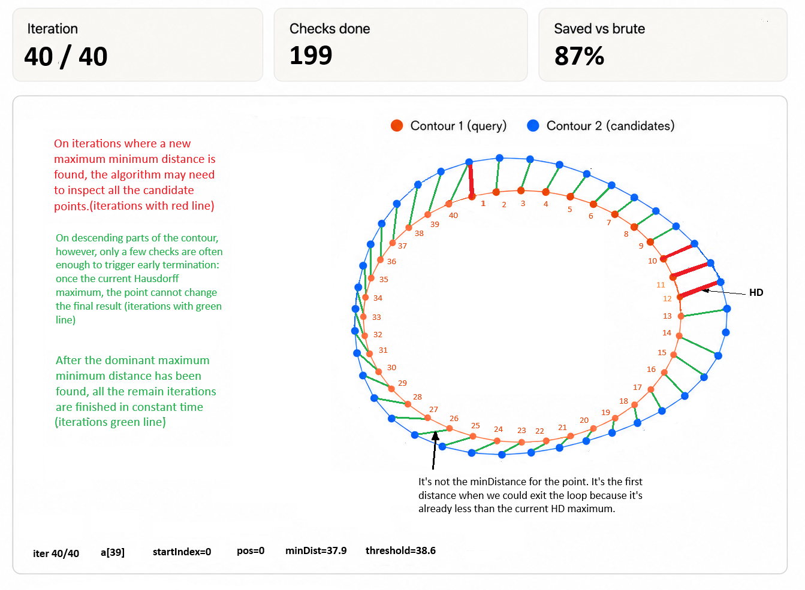

# Contour-Coherent Hausdorff Distance


Fast exact discrete Hausdorff distance for ordered contours.

This project implements a contour-coherent search strategy for computing the exact discrete Hausdorff distance between two ordered contours.

The method is designed for naturally ordered contour data, such as object boundaries extracted from binary images. It is especially useful when contours are related, similar, or represent consecutive states of the same object. It's also good for other cases, especially when memory usage is important.

The core algorithm is header-only and dependency-free.


## Overview


The method exploits a simple observation:

For related ordered contours, nearest-neighbor indices often change gradually between consecutive contour points.

Instead of scanning the entire target contour from the beginning for every source point, the algorithm starts near the previous nearest-neighbor location, applies a small forward bias, and expands bidirectionally around that position (start\_point, start\_point - 1, start\_point + 1, start\_point - 2, start\_point + 2, etc).

The result is still the exact discrete Hausdorff distance, not an approximation.


## Visualization




The expensive iterations are typically the ones that increase the current Hausdorff maximum. On descending parts of the contour, only a few checks are often enough to trigger early termination: once the current minimum distance falls below the current Hausdorff maximum, the point cannot change the final result.

The repository also includes interactive HTML visualizations:


* [Contour-coherent search](https://Kate-droid-cpu.github.io/contour-coherent-hausdorff/visualizations/contour_coherent_search.html)
* [Comparing with Brute-force with early break](https://Kate-droid-cpu.github.io/contour-coherent-hausdorff/visualizations/hausdorff_vs_bruteforce.html)
* [Brute-force with shuffling](https://Kate-droid-cpu.github.io/contour-coherent-hausdorff/visualizations/hausdorff_shuffle_early_stop.html)
* [KD-tree nearest-neighbor baseline](https://Kate-droid-cpu.github.io/contour-coherent-hausdorff/visualizations/kdtree_contour_build_search.html)


GitHub may display these HTML files as source code. To view them interactively, open them locally in a browser or publish the `docs/` folder with GitHub Pages.


## Target use cases


This method is intended for related ordered contours, such as:

* segmentation mask comparison
* video or tracking contour sequences
* industrial inspection against a reference contour
* regression testing of contour extraction algorithms
* shape evolution over time
* batches of similar silhouettes or object boundaries

It is not intended as a universal accelerator for arbitrary unordered point clouds.


## Algorithm idea


For the directed Hausdorff distance from contour `A` to contour `B`:

```text
h_max = 0
start = 0

for each point a_i in A:
    current_min = infinity
    best_index = start

    search B by expanding bidirectionally around start:
        d = distance(a_i, B[j])

        if d < current_min:
            current_min = d
            best_index = j

        if current_min <= h_max:
            break

    start = best_index + 1
    h_max = max(h_max, current_min)

return h_max
```

The symmetric Hausdorff distance is computed as:

```text
H(A, B) = max(h(A, B), h(B, A))
```

The `best_index + 1` update is a forward prediction for ordered contours: if `a[i]` matched near `b[j]`, then `a[i + 1]` often matches near `b[j + 1]`.

## Correctness

The early termination condition is exact for max-based Hausdorff distance.

Once the current minimum distance for a source point is not greater than the current directed Hausdorff maximum, this point cannot increase the final directed Hausdorff distance. Additional candidate checks can only keep the current minimum the same or decrease it.

Therefore, stopping the search for that source point is safe.

## Complexity

The worst-case complexity remains:

```text
O(n * m)
```

for contours of sizes `n` and `m`.

However, the actual number of distance evaluations is:

```text
sum_i w_i
```

where `w_i` is the number of candidate target points inspected for the `i`-th source point.

For coherent ordered contours, `w_i` is often small in practice. If the local search width is bounded by a small constant, the directed computation behaves close to:

```text
O(n)
```

and the symmetric computation behaves close to:

```text
O(n + m)
```

This is practical behavior under contour-coherence assumptions, not a worst-case guarantee.

## Core API

The main header is:

```cpp
#include "ContourHausdorff/ContourCoherentHausdorffDistance.hpp"
```

Example:

```cpp
#include "ContourHausdorff/ContourCoherentHausdorffDistance.hpp"

#include <iostream>
#include <vector>

int main()
{
    using Point = ContourHausdorff::CPointI;

    std::vector<Point> contour1 = {
        {0, 0}, {1, 0}, {2, 0}
    };

    std::vector<Point> contour2 = {
        {0, 1}, {1, 1}, {2, 1}
    };

    const auto [checks, hd] =
        ContourHausdorff::CalcContourCoherentHausdorffDistance(
            contour1,
            contour2
        );

    std::cout << "checks = " << checks << "\n";
    std::cout << "HD     = " << hd << "\n";
}
```

## Distance policies

The implementation supports custom point types and distance policies.

Built-in distance policies:

* `SquaredL2Distance`
* `L1Distance`
* `ChebyshevDistance`

Default:

```cpp
ContourHausdorff::SquaredL2Distance
```

Squared L2 is used internally for performance, and the square root is applied only to the final result.

## Benchmarks

The benchmark tool compares:

* contour-coherent Hausdorff distance
* brute-force Hausdorff with early stop
* brute-force Hausdorff with early stop and deterministic shuffling
* Boost.Geometry discrete Hausdorff distance
* OpenCV FLANN KD-tree baseline
* OpenCV HausdorffDistanceExtractor baseline

Example benchmark output:

```text
Contour-Coherent Hausdorff, all contour pairs
  pairs in package        = 66
  median total package    = 257.859400 ms
  avg total package       = 256.688720 ms
  median per HD           = 3.906961 ms
  total checks            = 215825292
  avg HD                  = 55.312265
```

## Example results

### Related walking silhouettes

Package:

```text
21 contours
210 all-pairs Hausdorff evaluations
average HD = 14.56
```

|Method|Total package time|Time per HD|Checks|
|-|-:|-:|-:|
|Contour-coherent|50.48 ms|0.240 ms|45.4M|
|Brute-force + shuffle|821.73 ms|3.913 ms|724.7M|
|Brute-force early stop|4487.38 ms|21.37 ms|4107.9M|
|Boost discrete Hausdorff|12382.56 ms|58.96 ms|—|

On this package, the contour-coherent method was approximately:

* 16.3x faster than brute-force with shuffling
* 88.9x faster than deterministic brute-force with early stop
* 245x faster than Boost.Geometry discrete Hausdorff

### Kimia99

Package:

```text
99 contours
4851 all-pairs Hausdorff evaluations
average HD = 41.10
```

|Method|Total package time|Time per HD|Checks|
|-|-:|-:|-:|
|Contour-coherent|127.91 ms|0.026 ms|87.4M|
|Brute-force + shuffle|163.84 ms|0.034 ms|48.2M|
|Brute-force early stop|516.55 ms|0.106 ms|424.9M|

On this generic shape dataset, the contour-coherent method remained faster than randomized shuffling despite performing more distance checks, likely due to better memory locality and deterministic traversal.

### Kimia216

Package:

```text
216 contours
23220 all-pairs Hausdorff evaluations
average HD = 48.72
```

|Method|Total package time|Time per HD|Checks|
|-|-:|-:|-:|
|Contour-coherent|813.40 ms|0.035 ms|602.9M|
|Brute-force + shuffle|812.02 ms|0.035 ms|248.4M|
|Brute-force early stop|2662.64 ms|0.115 ms|2337.4M|

Kimia216 contains many dissimilar all-vs-all shape pairs, which is not the main target scenario for this method. Even there, the contour-coherent method remained competitive with randomized shuffling.

### MPEG-7 children class

Package:

```text
20 contours
190 all-pairs Hausdorff evaluations
average HD = 4.22
```

|Method|Total package time|Time per HD|Checks|
|-|-:|-:|-:|
|Contour-coherent|2.43 ms|0.013 ms|1.34M|
|Brute-force + shuffle|17.02 ms|0.090 ms|10.89M|
|Brute-force early stop|34.61 ms|0.182 ms|28.97M|

On this MPEG-7 class, the contour-coherent method was approximately 7x faster than brute-force with shuffling.

### Snowflake contours

Package:

```text
12 large complex contours
66 all-pairs Hausdorff evaluations
23k-28k points per contour
average HD = 55.31
```

|Method|Total package time|Time per HD|Checks|
|-|-:|-:|-:|
|Contour-coherent|255.26 ms|3.868 ms|215.8M|
|Brute-force + shuffle|661.05 ms|10.016 ms|493.6M|
|Brute-force early stop|42353.77 ms|641.724 ms|39321.0M|

Even on large, detailed, partially repetitive contours, the contour-coherent method remained faster than the shuffled baseline.

## Build

### Windows

Requirements:

* Visual Studio 2026
* CMake
* Ninja
* vcpkg
* OpenCV
* Boost

Configure and build:

```powershell
cmake --preset x64-release
cmake --build out\\build\\x64-release
```

Run benchmarks:

```powershell
powershell -ExecutionPolicy Bypass -File .\\HausdorffDistanceOptimized\\scripts\\run_benchmarks.ps1
```

### Linux / WSL

Install dependencies:

```bash
sudo apt update
sudo apt install -y build-essential cmake ninja-build libopencv-dev libboost-all-dev
```

Configure and build:

```bash
cmake -S . -B \~/build/hd-linux-release -G Ninja -DCMAKE\_BUILD\_TYPE=Release
cmake --build \~/build/hd-linux-release
```

Run benchmarks:

```bash
./HausdorffDistanceOptimized/scripts/run_benchmarks.sh
```

## Command-line usage

```text
HausdorffDistanceOptimized.exe --folder <path> \[--folder <path> ...] \[--batches N] \[--algorithms contour,bruteforce,shuffle,boost,kdtree|all]
```

Examples:

```powershell
HausdorffDistanceOptimized.exe `
  --folder pathToImages\\snowflake `
  --batches 3 `
  --algorithms contour,shuffle,bruteforce
```

```bash
./HausdorffDistanceOptimized \\
  --folder ./TestImages/snowflake \\
  --batches 3 \\
  --algorithms contour,shuffle,bruteforce
```

Supported algorithms:

```text
contour / cc / contourcoherent
bruteforce / bf
shuffle / shuffling
boost
kdtree / kd
all
```

## Project structure

```text
include/
  ContourHausdorff/
    ContourCoherentHausdorffDistance.hpp

src/
  baselines/
    HausdorffDistanceBruteForce.hpp
    HausdorffDistanceBaselineLibs.h
    HausdorffDistanceBaselineLibs.cpp

  benchmark/
    Benchmarks.h
    BenchmarkCli.h
    BenchmarkCli.cpp

  image/
    ContourExtractor.h
    ContourExtractor.cpp

docs/
  images/
    HD_contour_coherent.png

  visualizations/
    contour_coherent_search.html
    hausdorff_bruteforce_no_stop.html
    hausdorff_bruteforce_viz.html
    hausdorff_shuffle_early_stop.html
    hausdorff_vs_bruteforce.html
    kdtree_contour_build_search.html

scripts/
  run_benchmarks.ps1
  run_benchmarks.sh

main.cpp
CMakeLists.txt
CMakePresets.json
```

The core algorithm is located in:

```text
include/ContourHausdorff/ContourCoherentHausdorffDistance.hpp
```

OpenCV and Boost are used only for image loading and baseline benchmarks.

## Limitations

The method is optimized for ordered, coherent contours.

It may be less effective when:

* the input points are unordered
* the two contours are unrelated
* the nearest-neighbor index jumps unpredictably
* the contour sampling is inconsistent
* the data is a generic point cloud rather than an ordered boundary

The worst-case complexity remains `O(n * m)`.

## Related work

The method is related to early-break and spatial-search approaches for Hausdorff distance computation. Prior work has explored spatial ordering, Z-order curves, octrees, KD-trees, and diffusion-center strategies for accelerating Hausdorff distance on generic point sets and 3D models.

This project focuses on a different practical setting: naturally ordered 2D contours. Instead of constructing a spatial ordering or spatial index, it directly uses the existing contour order and propagates the nearest-neighbor search position along the contour.

The method should be understood as a contour-specific exact fast path rather than a universal Hausdorff distance replacement.

## License

This project is licensed under the MIT License.
See the [LICENSE](LICENSE) file for details.

